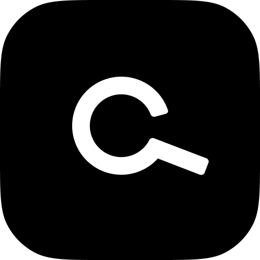

# CommandBarIOS

[](https://github.com/tryfoobar/CommandBarIOS/actions/workflows/ci.yml)

Nudges, Copilot & HelpHub in IOS

## Requirements

## Installation

### CocoaPods

CommandBarIOS is available through [CocoaPods](https://cocoapods.org). To install
it, simply add the following line to your Podfile:

```ruby
pod 'CommandBarIOS'
```

### Swift Package Manager

To install it using Swift Package Manager, add the following to your `Package.swift` file:

```
dependencies: [
    .package(url: "https://github.com/tryfoobar/CommandBarIOS.git", from: "1.0.9")
]
```

## Usage

### 1. Import the SDK

```
import CommandBarIOS
```

### 2. Initialize the SDK

Boot CommandBar as early as possible in your app with your org ID from [CommandBar](https://mobile.commandbar.com). Optionally, you can pass a user_id for your currently logged in user to boot.

```
class AppDelegate: UIResponder, UIApplicationDelegate {

    var window: UIWindow?

    func application(_ application: UIApplication, didFinishLaunchingWithOptions launchOptions: [UIApplicationLaunchOptionsKey: Any]?) -> Bool {
        // Calling `.boot` prepares the SDK for use within your app
        CommandBarSDK.shared.boot("<your org id>")

        // (Optionally) Pass in a user_id with CommandBarOptions
        CommandBarSDK.shared.boot("<your org id>", CommandBarOptions(user_id: "<your user id>"))
        return true
    }
}
```

### 3. (Optional) Get notified of CommandBar boot status

```
// Inherit the CommandBarSDKDelegate protocol
class AppDelegate: UIResponder, UIApplicationDelegate, CommandBarSDKDelegate {

    var window: UIWindow?

    func application(_ application: UIApplication, didFinishLaunchingWithOptions launchOptions: [UIApplicationLaunchOptionsKey: Any]?) -> Bool {
        // Calling `.boot` prepares the SDK for use within your app
        CommandBarSDK.shared.boot("<your org id>")
    }

    // Conform to the protocol
    func didFinishBooting(withError error: Error?) {
      // If CommandBar failed to boot for some reason, an error will be passed, otherwise it will be null
    }
}
```

### 4. (Optional) Track Events

You can use the `trackEvent` method to trigger Nudges. Right now, this is all this method is used for. Configure your Nudge Targeting to trigger when some event that you define is fired. See more on our [docs](https://www.commandbar.com/docs/guides/personalization/who-when-where/#by-event).

Once CommandBar is booted you can call `CommandBarSDK.shared.trackEvent("<your_event_name>")`. Please check out our Example app for usage as well as the sample below:

```
struct MyView: View {
  var body: some View {
    Button(action: {
      CommandBarSDK.shared.trackEvent("<your_event_name>")
    }) {
      Text("Tap me!").padding()
    }
  }
}
```

### 5.(Optional) Run the Example App

To run the example project, first clone the repo, then:

1. `cd CommandBarIOS/Example && pod install`
2. Open `Example/CommandBarIOS.xcworkspace` in Xcode
3. Navigate to `HomeView.swift` and replace the `ORG_ID` variable with your Organization's ID from [CommandBar](https://mobile.commandbar.com)
4. Run the App 🎉

## License

CommandBarIOS is available under the MIT license. See the LICENSE file for more info.
